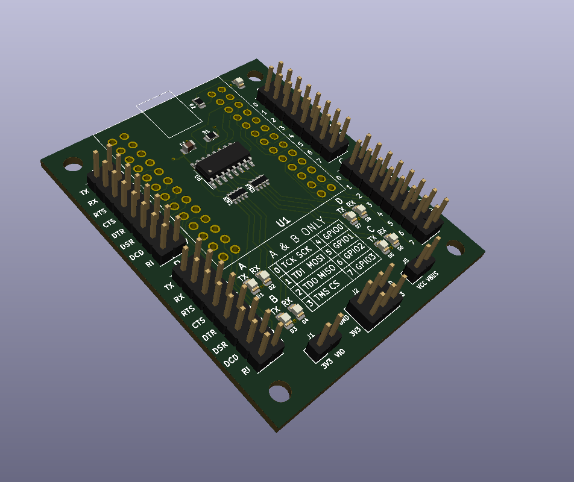
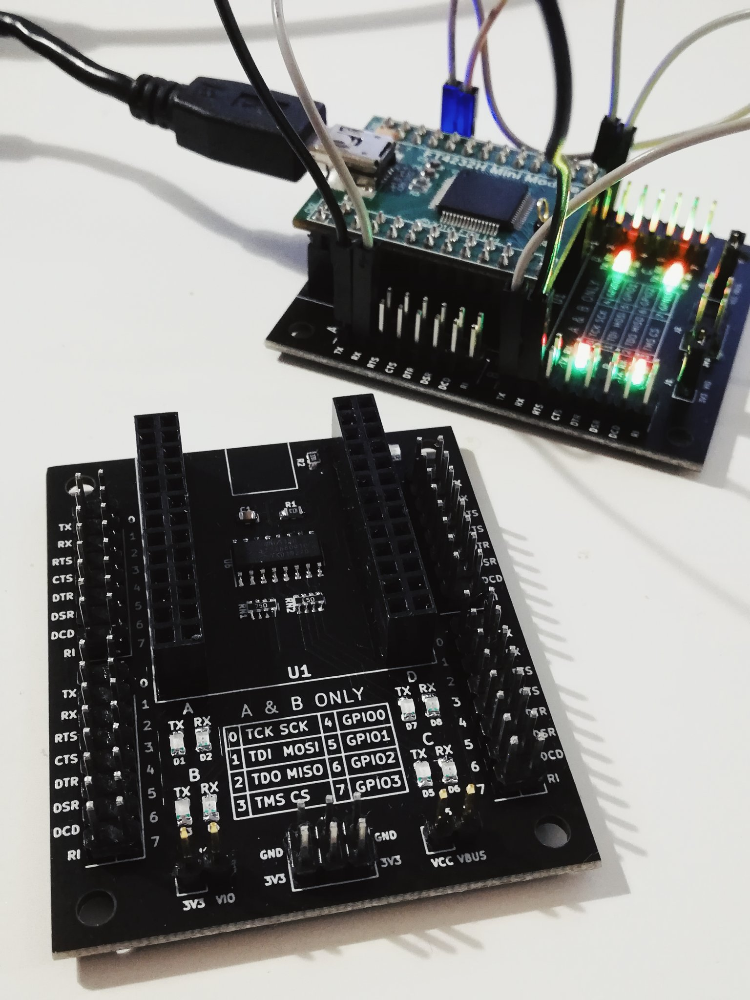

# NEON - FT4232H Mini Module Adapter 

### about the project

 Neon is a PCB project designed as an adapter for FTDI FT4232H Mini Module board. It includes four two rows UART sockets (A, B, C, D) for easy plugging in logic analyzer and LEDs on both TX/RX and USB power supply. Its main goal is to improve the experience of using FTDI Mini Module and allow to quickly and easily debug any possible issues. It was designed using [KiCad](https://kicad-pcb.org/).

Version 1.0 is available [in the releases section](https://github.com/alicjamusial/neon/releases/tag/neon-v.1.0).

### usage
To be able to use Neon powered by USB two jumpers needs to be placed on the board (on J1 (3V3 & VIO) and J5 (VCC & VBUS) elements).

### license
Neon is available on Creative Commons Attribution Share Alike 4.0 International license (more in [license file](LICENSE.txt)). You are free to use it, modify it and produce as many of your own neons as you need :)

### assembled neon ✨

#### TODO in version 1.1
* label for D9 LED on board,
* labels for the directions of all LEDs on board,
* ...any ideas/fixes/improvements/PRs are welcomed :)